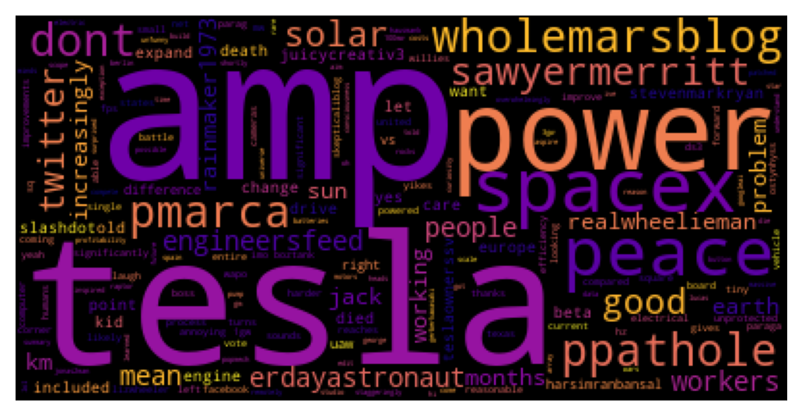
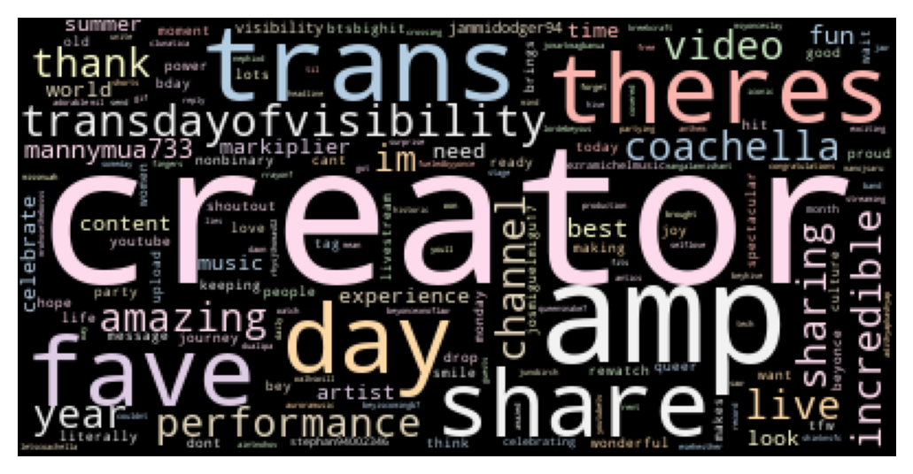

# Twitter WordCloud Generator using Streamlit

A simple Word Cloud generator that utilizes Python's wordcloud (for creating the word cloud), twint (for mining tweets), and streamlit (for app deployment) packages.

<strong>Wordcloud for the 1600 most recent tweets of @BarackObama</strong>

<strong>Wordcloud for the 1600 most recent tweets of @elonmusk</strong>

<strong>Wordcloud for the 1600 most recent tweets of @nasa</strong>

<strong>Wordcloud for the 1600 most recent tweets of @YouTube</strong>

Accessing the App
=================

To access this app, you can either

1. Clone the repository. Then, run 

`pip install -r requirements.txt`

on the terminal. It is ideal to create a virtual environment first before proceeding to the installation of the required libraries. Once done, you can then run

`streamlit run app.py`

on the terminal and use the app on your local server.

OR

2. Access the app via Streamlit Sharing through this [link](https://share.streamlit.io/arnelmalubay/twitter-wordcloud-generator-using-streamlit/main/app.py).